# MultiTiendas CelPhone 3D — Domain Context & Ubiquitous Language

Documento de contexto de dominio para el ecosistema **MultiTiendas CelPhone 3D**, estableciendo el lenguaje ubicuo, modelos y reglas de negocio.

---

## 1. Lenguaje Ubicuo (Ubiquitous Language)

- **Boutique / Store (Tienda):** Entidad tenant que agrupa una colección curada de smartphones y accesorios, con identidad gráfica personalizada, WhatsApp oficial y gerente asociado.
- **Tenant:** Aislamiento lógico de datos por `store_id`. Cada tienda es un tenant independiente con control de acceso mediante Row Level Security (RLS).
- **Generational Category (Categoría Generacional):** Clasificación cronológica de valor de un producto:
  - `last_2_years`: Modelos insignia de vanguardia lanzados en los últimos 2 años (ej. 2024–2026) con titanio y chips de última generación.
  - `recent_gen`: Smartphones modernos de generaciones recientes con alta relación calidad/precio.
  - `vintage_classic`: Teléfonos clásicos legendarios (1998–2012) para coleccionismo, durabilidad extrema o detox digital.
- **Depth Map (Mapa de Profundidad):** Textura en escala de grises que codifica la distancia de cada píxel de la foto del producto para renderizar relieve 3D interactivo en GPU mediante GLSL.
- **Stock Lock (Bloqueo de Stock):** Operación transaccional atómica (`FOR UPDATE` / mutación atómica) que asegura la deducción sin condiciones de carrera en compras concurrentes.
- **Cart Tenant Isolation (Aislamiento de Carrito):** Regla de negocio que prohíbe que un usuario mezcle productos de más de una boutique en una sola orden.
- **Authoritative Price (Precio Canónico/Autoritativo):** Precio obtenido exclusivamente de la base de datos oficial del servidor, desestimando cualquier valor enviado por el cliente.

---

## 2. Límites del Sistema (Bounded Contexts)

```mermaid
graph LR
    subgraph CATALOG["Catálogo & Exploración"]
        C1[Navegación Generacional]
        C2[Visor 3D Depth Map]
        C3[Comparador de Modelos]
    end

    subgraph SALES["Ventas & Checkout"]
        S1[Guardián de Carrito Multi-Tenant]
        S2[Pasarela MercadoPago SDK]
        S3[Pedido 1-Click WhatsApp]
    end

    subgraph INVENTORY["Inventario & Stock"]
        I1[Deducción Atómica de Stock]
        I2[Bloqueo Anti-Concurrencia]
    end

    subgraph ADMIN["Gestión & Multi-Tenancy"]
        A1[RBAC Gerente / SuperAdmin]
        A2[Editor Masivo de Stock]
        A3[Pipeline de Profundidad AI]
    end

    CATALOG --> SALES
    SALES --> INVENTORY
    ADMIN --> CATALOG
    ADMIN --> INVENTORY
```

---

## 3. Reglas de Negocio Inmutables

1. **Precios en el Servidor:** Ningún precio enviado desde el cliente en solicitudes de compra es confiable; el servidor siempre calcula el total consultando la base de datos canónica.
2. **Exclusividad de Boutique en Carrito:** Un pedido solo puede pertenecer a un único `store_id`. Si el cliente añade un artículo de otra tienda, el carrito debe alertar al usuario antes de reemplazar o separar la compra.
3. **Control de Borradores:** Ningún producto con `status !== 'published'` es visible para clientes públicos.
4. **Mutación por Tenant:** Un gerente autenticado únicamente puede crear, modificar o eliminar recursos pertenecientes a su `storeId`.
