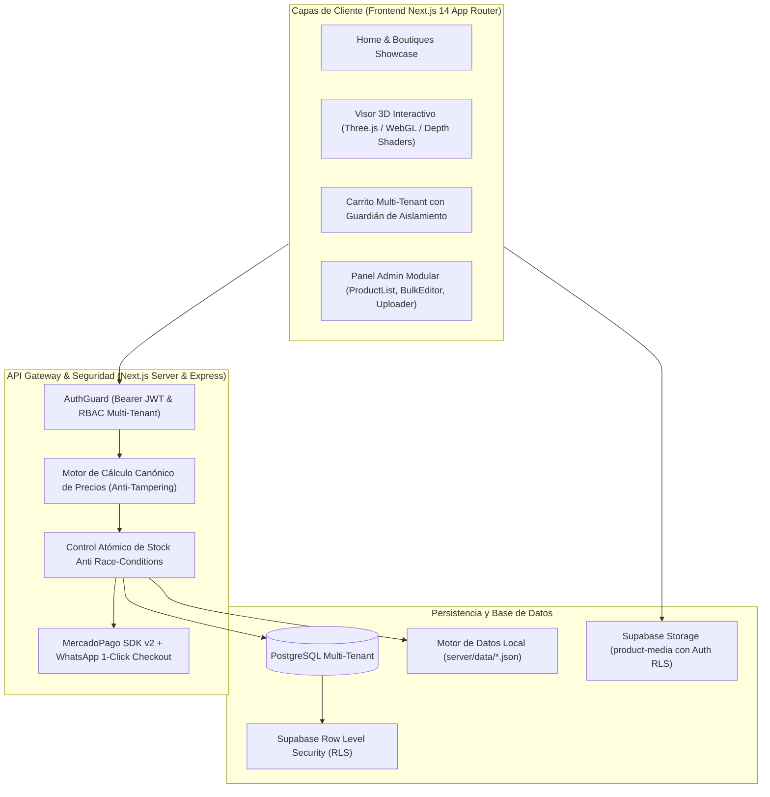

# 📱 CelStore™ — Tienda Moderna de Celulares de Alta Gama

<div align="center">


<p align="center">
  <b>Tienda premium de smartphones con estética <i>iPhone × Gucci Atelier</i>, visor 3D interactivo con Depth Maps acelerados por GPU, arquitectura Next.js 14 App Router, seguridad multi-tenant con Row Level Security (RLS), control de stock atómico anti-concurrencia y pasarelas de pago instantáneas.</b>
</p>

[✨ Ver Características](#-características-principales) •
[🏛️ Arquitectura](#-arquitectura-del-sistema) •
[🔒 Seguridad & Hardening](#-seguridad-y-hardening-owasp) •
[🧪 Pruebas](#-suite-de-pruebas-automatizadas) •
[🚀 Instalación](#-puesta-en-marcha) •
[📖 Documentación de Dominio](#-documentación-de-dominio)

---

</div>

## 🌟 Visión del Producto

**CelStore** redefine la experiencia de compra de smartphones combinando el minimalismo editorial de Apple con la exclusividad boutique de casas de alta costura:

- **Ecosistema Multi-Tenant Aislado:** Múltiples boutiques independientes con catálogo propio, identidad visual y reglas de inventario exclusivas.
- **Segmentación Generacional Curada:** Navegación por tres grandes eras:
  - 💎 **Últimos 2 Años (2024–2026):** Flagships en titanio, IA integrada y cámaras periscópicas.
  - ⚡ **Generaciones Recientes:** Relación costo-rendimiento superior.
  - 📟 **Clásicos & Leyendas Vintage (1998–2012):** Teléfonos icónicos para coleccionistas, detox digital y resistencia indestructible.
- **Experiencia 3D Depth Map en GPU:** Modelos tridimensionales con shaders GLSL personalizados y mapas de profundidad que generan relieve reactivo a la luz y al puntero con 60 FPS fluidos.

---

## 🏛️ Arquitectura del Sistema



---

## ✨ Características Principales

### 1. 🎨 Estética *iPhone × Gucci Atelier*
- Paleta cromática refinada (60-30-10), tipografías Apple SF Pro / Inter, glassmorphism con efecto difuso y animaciones micro-interactivas con Framer Motion.
- Modos oscuros profundos con acentos en oro champán, titanio natural y contrastes de alta gama.

### 2. 🧊 Visor 3D y Relieve Dinámico por GPU
- **Shaders GLSL Propios:** Desplazamiento de vértices e iluminación espectral reactiva al movimiento del ratón/giroscopio (`depthPhotoShader.js`).
- **Lazy Loading Three.js:** La carga del motor 3D está desacoplada del bundle inicial, garantizando un **LCP < 1.2s**.
- **WebGL Fallback:** Conmutación automática a galería 2D de ultra alta definición en dispositivos con ahorro de batería extremo o sin soporte WebGL.

### 3. 🛡️ Guardián de Carrito Multi-Tenant
- Aislamiento total de pedidos entre boutiques: impide mezclar productos de diferentes tiendas en una misma transacción.
- Detección inteligente de conflictos con modal de resolución en un clic.

### 4. 🎛️ Panel de Administración Modular
Estructurado sin componentes monolíticos (*Anti God-Component*):
- `ProductList.jsx`: Tabla reactiva con filtros de estado (Borrador / Publicado), búsqueda y ordenamiento.
- `ProductFormModal.jsx`: Formulario validado con esquemas Zod rigurosos.
- `BulkStockEditor.jsx`: Edición masiva instantánea de stocks y precios sin recargar vistas.
- `ImageUploader.jsx`: Carga drag-and-drop a Supabase Storage con previsualización en vivo.
- `OrdersTracker.jsx`: Visualización de pedidos en tiempo real con integración directa a WhatsApp del comprador.

---

## 🔒 Seguridad y Hardening (OWASP Top 10)

El sistema cuenta con protecciones de nivel bancario y de comercio electrónico moderno:

| Vulnerabilidad Mitigada | Mecanismo de Defensa Implementado |
| :--- | :--- |
| **Price Parameter Tampering (OWASP A04)** | El servidor ignora los precios enviados por el cliente y consulta siempre la base de datos oficial para fijar montos en órdenes y preferencias de MercadoPago. |
| **Broken Access Control (OWASP A01)** | Helper `authGuard.js` con verificación estricta de roles (`superadmin`, `store_manager`) y validación de `storeId` en operaciones `PUT`, `POST` y `DELETE`. |
| **Supabase Storage Open Access (OWASP A01)** | Políticas RLS en `storage.objects` restringidas con cláusulas `TO authenticated` y comprobación de roles autorizados. |
| **Backdoor Bypass Elimination (OWASP A07)** | Eliminación de credenciales maestras estáticas; autenticación estricta con hashing y tokens individuales por tenant. |
| **Draft Product Exposure** | Los productos en estado `draft` o `archived` no pueden ser descubiertos por clientes no autenticados. |
| **Atomic Stock Concurrency (Race Conditions)** | Operaciones con bloqueo de fila `FOR UPDATE` en SQL / control atómico en memoria que eliminan sobreventas. |

---

## 🧪 Suite de Pruebas Automatizadas

La plataforma incluye una suite completa de pruebas unitarias, de integración y de seguridad con **Vitest**:

```bash
npm test
```

### Cobertura de Tests (14/14 Pasando):
1. **`tests/security-audit.test.js`**:
   - Prevención de manipulación de precios ($0.01 payload override).
   - Aislamiento RBAC multi-tenant (superadmin vs gerente de boutique).
   - Parser seguro de tokens Bearer y rechazo de tokens forjados.
   - Bloqueo de contraseñas de backdoor universal.
2. **`tests/stock-concurrency.test.js`**:
   - Deducción atómica de inventario.
   - Prevención de condiciones de carrera en compras concurrentes sobre la última unidad disponible.
3. **`tests/cart-multitenant.test.js`**:
   - Detección de colisiones cross-tenant al agregar productos de diferentes boutiques.
4. **`tests/product-validation.test.js`**:
   - Validación de esquemas Zod (precios positivos, stock entero no negativo, campos requeridos).

---

## 🚀 Puesta en Marcha

### Prerrequisitos
- Node.js 18+ o superior
- npm 9+ o superior

### 1. Clonar e Instalar
```bash
git clone https://github.com/ExeDevCentral/MultiTiendasCelphone.git
cd MultiTiendasCelphone
npm install
```

### 2. Variables de Entorno (Opcional para servicios en la nube)
Crea un archivo `.env.local` en la raíz:
```env
PORT=5000
ADMIN_PASSWORD=admin123
MERCADOPAGO_ACCESS_TOKEN=TEST-0000000000000000-000000-00000000000000000000000000000000-000000000
SUPABASE_URL=https://your-project.supabase.co
SUPABASE_ANON_KEY=your-anon-key
SUPABASE_SERVICE_ROLE_KEY=your-service-role-key
REPLICATE_API_TOKEN=your-replicate-token
```

### 3. Ejecutar en Desarrollo
```bash
npm run dev
```
> La aplicación estará disponible en `http://localhost:3000`.

### 4. Compilar para Producción
```bash
npm run build
npm start
```

---

## 🔑 Credenciales de Prueba por Defecto

| Tienda / Rol | Correo Electrónico | Contraseña | Especialidad |
| :--- | :--- | :--- | :--- |
| 📱 **CelStore Flagships** | `admin@celstore.com` | `password123` | Flagships & Últimos 2 Años (2024–2026) |
| 📟 **RetroMobile Vault** | `admin@retromobile.com` | `password123` | Clásicos & Vintage Legends (1998–2012) |
| ⚡ **TechNova MegaStore** | `admin@technova.com` | `password123` | Catálogo Híbrido & Accesorios Universales |
| 👑 **SuperAdmin Global** | `admin@celstore.com` | `admin123` | Gestión Global de la Plataforma |

---

## 📖 Documentación de Dominio

- [CONTEXT.md](file:///c:/Users/exeme/Desktop/MultiTiendasCelphone-main/CONTEXT.md): Lenguaje ubicuo, conceptos de dominio y límites del modelo.
- [docs/adr/0001-depth-anything-v2-pipeline.md](file:///c:/Users/exeme/Desktop/MultiTiendasCelphone-main/docs/adr/0001-depth-anything-v2-pipeline.md): Pipeline de estimación de profundidad con Depth Anything V2.
- [docs/adr/0002-r3f-lazy-canvas-lifecycle.md](file:///c:/Users/exeme/Desktop/MultiTiendasCelphone-main/docs/adr/0002-r3f-lazy-canvas-lifecycle.md): Ciclo de vida y Lazy Loading en React Three Fiber.
- [docs/adr/0003-security-and-price-anti-tampering.md](file:///c:/Users/exeme/Desktop/MultiTiendasCelphone-main/docs/adr/0003-security-and-price-anti-tampering.md): Estrategia de seguridad y protección anti-manipulación de precios.

---

## 📄 Licencia

Desarrollado con pasión y precisión artesanal por **ExeDevCentral**.
Distribuido bajo la licencia MIT.
